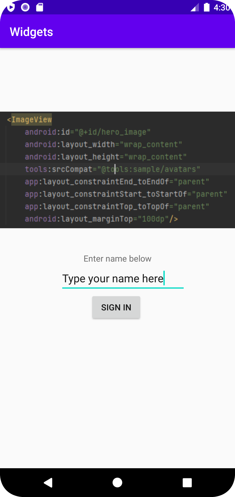

# Rapport

Det som behövdes göras i denna uppgift  var att lägga till 3 widgets. Det som gjordes först var att gå in i "design" inuti activity_main och dra tre widgets till activity_main.
Därefter sattes constraints då appen använder sig av constraintlayout. Efter detta var dessa widgets i princip placerade korrekt men behövde justeras lite.
Detta gjordes sedan med hjälp av margin för att positionera alla widgets korrekt. En bild lades även till i bild elementet då det var tomt från start.3

Exempel på kod där margin och constraint användes för att positionera de widgets som finns i appen.

```
    <Button
        android:id="@+id/signin_button"
        android:layout_width="wrap_content"
        android:layout_height="wrap_content"
        android:text="Sign in"
        app:layout_constraintTop_toBottomOf="@id/signin_name"
        app:layout_constraintStart_toStartOf="@id/signin_name"
        android:layout_marginLeft="50dp"/>
```



